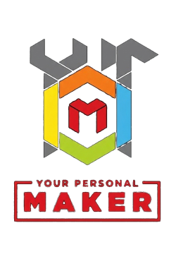

# Open Source Code Repositories & Git Forges

A curated list and comprehensive comparison of public code repositories, cloud-hosted Git platforms, and self-hostable open-source forge alternatives to GitHub.

---

## Table of Contents

- [Overview](#overview)
- [Comprehensive Comparison Table](#comprehensive-comparison-table)
- [Categories & Recommendations](#categories--recommendations)
  - [Enterprise & Full DevSecOps Platforms](#enterprise--full-devsecops-platforms)
  - [Lightweight & Resource-Friendly Self-Hosted Forges](#lightweight--resource-friendly-self-hosted-forges)
  - [Decentralized & Peer-to-Peer Networks](#decentralized--peer-to-peer-networks)
  - [Public Libre & Community Forges](#public-libre--community-forges)
  - [Minimalist & CLI/Email-Driven Forges](#minimalist--cliemail-driven-forges)
- [Contributing](#contributing)
- [License](#license)

---

## Overview

While GitHub remains the dominant platform for software collaboration, the developer ecosystem provides dozens of diverse alternatives. These range from community-governed public forges (like Codeberg) and comprehensive DevSecOps suites (like GitLab) to lightweight self-contained Go/C binaries (like Forgejo, Gitea, and CGit) and decentralized protocols (like Radicle).

This repository catalogs both **hosted platforms** and **self-hostable forge software** to help developers and organizations choose the right home for their source code.

---

## Comprehensive Comparison Table

| Name | Description | Self-Hostable? | Primary License / Model | Official Website |
| :--- | :--- | :---: | :--- | :--- |
| **[GitHub](https://github.com)** | World's largest collaborative platform; issues, PRs, Discussions, Codespaces, and GitHub Actions CI/CD. | **Yes** (Enterprise Server) | Proprietary (Hosted / On-Prem) | [github.com](https://github.com) |
| **[GitLab](https://gitlab.com)** | Full DevSecOps lifecycle platform covering planning, source code management, CI/CD, and security scanning. | **Yes** (Community & Enterprise) | MIT (GitLab CE) / Proprietary (EE) | [gitlab.com](https://gitlab.com) |
| **[Apache Allura](https://allura.apache.org)** | Open-source forge software powering SourceForge; manages Git, SVN, Mercurial repositories, bug trackers, and wikis. | **Yes** | Apache-2.0 | [allura.apache.org](https://allura.apache.org) |
| **[Bitbucket](https://bitbucket.org)** | Atlassian's Git repository management solution, tightly integrated with Jira, Confluence, and Bitbucket Pipelines. | **Yes** (Data Center) | Proprietary (Cloud & Data Center) | [bitbucket.org](https://bitbucket.org) |
| **[Bonobo Git Server](https://bonobogitserver.com)** | Lightweight web-based Git repository manager built on ASP.NET for Windows Server and IIS environments. | **Yes** | MIT | [bonobogitserver.com](https://bonobogitserver.com) |
| **[CGit](https://git.zx2c4.com/cgit)** | Hyper-fast, low-overhead web frontend and repository browser written in C; powers `git.kernel.org`. | **Yes** | GPL-2.0 | [git.zx2c4.com/cgit](https://git.zx2c4.com/cgit) |
| **[Codeberg](https://codeberg.org)** | Non-profit, privacy-first public Git forge based in Germany, operated by a democratic association powered by Forgejo. | **No** (Hosted instance) | Non-profit Free Service | [codeberg.org](https://codeberg.org) |
| **[Forgejo](https://forgejo.org)** | Community-governed, 'soft-fork' of Gitea focused on software freedom, decentralization, and ActivityPub federation. | **Yes** | GPL-3.0-or-later | [forgejo.org](https://forgejo.org) |
| **[Fossil SCM](https://fossil-scm.org)** | Integrated distributed version control, bug tracker, wiki, technote, and forum bundled into a single zero-dependency executable. | **Yes** | BSD-2-Clause | [fossil-scm.org](https://fossil-scm.org) |
| **[Gerrit Code Review](https://www.gerritcodereview.com)** | Git-centric code review and repository hosting system utilizing patchset-based workflows; used by Android and Chromium. | **Yes** | Apache-2.0 | [gerritcodereview.com](https://www.gerritcodereview.com) |
| **[Gitea](https://gitea.com)** | Fast, lightweight, self-contained Git server written in Go with low memory consumption and built-in Actions CI runner. | **Yes** | MIT | [gitea.com](https://gitea.com) |
| **[GitBucket](https://gitbucket.github.io)** | GitHub-compatible clone running on the JVM (Scala); provides repository hosting, issues, pull requests, and plugin support. | **Yes** | Apache-2.0 | [gitbucket.github.io](https://gitbucket.github.io) |
| **[Gitblit](https://gitblit.github.io)** | Pure-Java stack and integrated Jetty web application designed to view, serve, and manage Git repositories without SQL. | **Yes** | Apache-2.0 | [gitblit.github.io](https://gitblit.github.io) |
| **[Gitee](https://gitee.com)** | Major Git hosting and collaboration service based in China, supporting government, open source, and enterprise teams. | **Yes** (Enterprise Edition) | Proprietary (SaaS / On-Prem) | [gitee.com](https://gitee.com) |
| **[Gitness (Harness)](https://gitness.com)** | Modern open-source developer platform combining fast Git hosting, code review, and container-native CI/CD automation. | **Yes** | Apache-2.0 | [gitness.com](https://gitness.com) |
| **[Gogs](https://gogs.io)** | Ultra-minimalist Go Git service designed for low-power hardware, ARM boards, and single-board computers (Raspberry Pi). | **Yes** | MIT | [gogs.io](https://gogs.io) |
| **[Gitolite](https://gitolite.com)** | Fine-grained access control and permissions layer for hosting multiple Git repositories securely over standard SSH. | **Yes** | GPL-2.0 | [gitolite.com](https://gitolite.com) |
| **[GNU Savannah](https://savannah.gnu.org)** | Free Software Foundation repository hub reserved exclusively for libre software projects that adhere strictly to GNU standards. | **Yes** (via Savane) | GPL-3.0-or-later | [savannah.gnu.org](https://savannah.gnu.org) |
| **[Kallithea](https://kallithea-scm.org)** | Member project of Software Freedom Conservancy providing unified management for both Git and Mercurial (Hg) repositories. | **Yes** | GPL-3.0-or-later | [kallithea-scm.org](https://kallithea-scm.org) |
| **[Launchpad](https://launchpad.net)** | Canonical's collaboration platform behind Ubuntu; features bug tracking, code hosting, translations, and PPA package building. | **Yes** | AGPL-3.0 | [launchpad.net](https://launchpad.net) |
| **[Notabug](https://notabug.org)** | Public Git hosting platform dedicated strictly to free and libre software, running on top of Gogs. | **No** (Hosted instance) | Free Community Service | [notabug.org](https://notabug.org) |
| **[OneDev](https://onedev.io)** | All-in-one Git server featuring visual CI/CD pipeline builders, Kanban task boards, and structural code symbol search. | **Yes** | MIT | [onedev.io](https://onedev.io) |
| **[OSDN](https://osdn.net)** | Software repository and mirror download network supporting Git, Subversion, and Mercurial. | **No** (Hosted service) | Proprietary Hosted Service | [osdn.net](https://osdn.net) |
| **[Pagure](https://pagure.io)** | Customizable, lightweight Git forge built by the Fedora Linux community with pull request and issue tracking support. | **Yes** | GPL-2.0-or-later | [pagure.io](https://pagure.io) |
| **[Phorge](https://we.phorge.it)** | Community fork of Phabricator providing comprehensive differential code reviews, audit trails, and project workboards. | **Yes** | Apache-2.0 | [we.phorge.it](https://we.phorge.it) |
| **[Radicle](https://radicle.xyz)** | Decentralized, peer-to-peer code collaboration network built on Git gossip protocols and public-key cryptography. | **Yes** (Local peer / Seed node) | Apache-2.0 / MIT | [radicle.xyz](https://radicle.xyz) |
| **[RhodeCode](https://rhodecode.com)** | Unified enterprise source code management system supporting Git, Mercurial, and SVN under a single access control layer. | **Yes** (CE & Enterprise) | AGPL-3.0 (CE) / Proprietary | [rhodecode.com](https://rhodecode.com) |
| **[SourceForge](https://sourceforge.net)** | Historic open-source repository and software directory providing Git, SVN, and Mercurial hosting and project downloads. | **No** (Hosted service) | Proprietary Hosted Service | [sourceforge.net](https://sourceforge.net) |
| **[SourceHut](https://sourcehut.org)** | Fast, lightweight, JavaScript-free suite of software tools built around Unix philosophy, Git/Hg, and email-based workflows. | **Yes** | AGPL-3.0 | [sourcehut.org](https://sourcehut.org) |
| **[Tuleap](https://tuleap.org)** | Open-source enterprise ALM platform combining Git, SVN, Scrum/Kanban boards, requirement management, and issue tracking. | **Yes** | GPL-2.0 | [tuleap.org](https://tuleap.org) |

---

## Categories & Recommendations

### Enterprise & Full DevSecOps Platforms
Best for companies and engineering departments requiring comprehensive CI/CD, security audits, compliance, and enterprise single sign-on (SSO/SAML):
- **GitLab (Self-Managed)**: The de facto standard for complete self-hosted DevOps lifecycles.
- **GitHub Enterprise Server**: Seamless compatibility with existing GitHub workflows behind corporate firewalls.
- **Tuleap & RhodeCode**: Excellent for mixed environments with legacy SVN or Mercurial needs.

### Lightweight & Resource-Friendly Self-Hosted Forges
Best for small teams, homelabs, VPS instances with <= 2 GB RAM, or single-board computers (Raspberry Pi):
- **Forgejo**: Community-first, zero corporate lock-in, low memory (~100MB RAM), active development.
- **Gitea**: Highly popular Go-based forge with extensive integrations and built-in actions runner.
- **OneDev**: Rich features (code navigation, visual CI/CD) with surprisingly low overhead.
- **Gogs**: Ultra-minimal footprint for very constrained embedded environments.

### Decentralized & Peer-to-Peer Networks
Best for censorship resistance, offline-first development, and sovereign identity:
- **Radicle**: Uses public-key cryptography and peer gossip protocols to sync repositories without relying on central hosts.
- **Fossil SCM**: Entire project (code, bugs, docs, wiki) stored in a single transportable SQLite file.

### Public Libre & Community Forges
Best for open-source developers seeking alternatives to big-tech hosted repositories:
- **Codeberg**: Managed by a non-profit association with strict privacy guarantees and European data sovereignty.
- **GNU Savannah**: The definitive home for official GNU and Free Software Foundation projects.
- **Pagure**: The upstream community forge designed for Fedora Linux package maintainers.

### Minimalist & CLI/Email-Driven Forges
Best for developers who prefer the traditional Linux kernel patch review model:
- **SourceHut (`sr.ht`)**: Blazing fast, 100% accessible without JavaScript, built on email-driven patch workflows (`git send-email`).
- **CGit**: Pure C web viewer for high-traffic read-only public repository inspection.
- **Gerrit**: Strict change-by-change patch reviews with verified test status gates.

---

## Contributing

Contributions, updates, and corrections are warmly welcomed!

1. Fork the repository.
2. Create your feature branch (`git checkout -b feature/add-new-forge`).
3. Commit your changes (`git commit -m 'Add new forge entry'`).
4. Push to the branch (`git push origin feature/add-new-forge`).
5. Open a Pull Request.

---

## License

This document and repository content are released into the public domain under the [Creative Commons Zero v1.0 Universal](LICENSE) (CC0 1.0).
